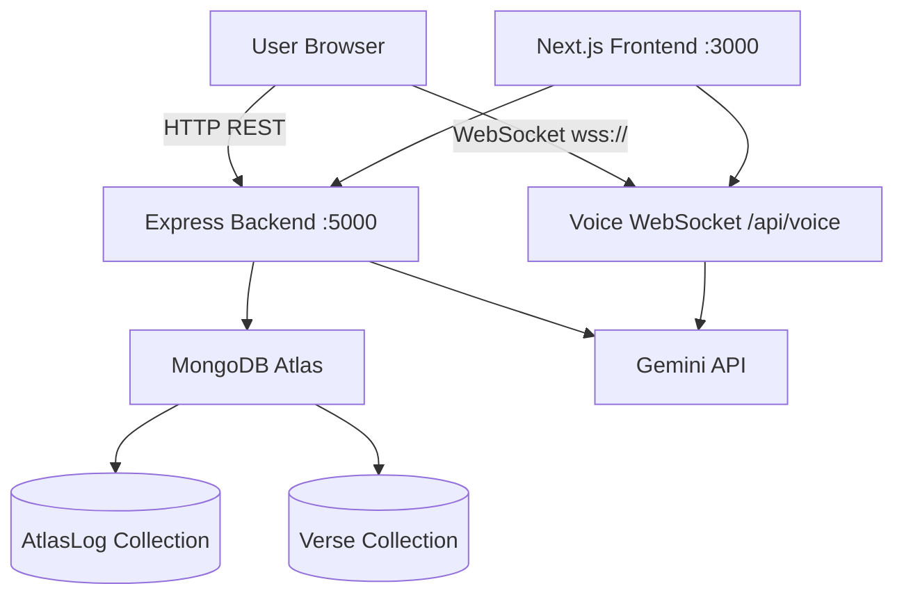

# 🪷 Digital Sanctuary — Full Project Analysis

> **Stack**: Next.js 16 (TypeScript) · Node.js / Express 5 · MongoDB · Google Gemini AI · WebSockets  
> **Analysed**: Backend + Frontend (full-stack)

---

## 1. Project Overview

**Digital Sanctuary** (branded *Arjuna Mode*) is an AI-powered mental wellness companion targeting Gen Z users (≤25). It blends Bhagavad Gita wisdom with modern psychology and Gemini AI to offer:

| Feature | Route / Service |
|---|---|
| Text-based AI companion (Arjuna Mode) | `POST /api/chat` |
| Mood tracking & daily check-ins (Inner Atlas) | `POST/GET /api/inner-atlas/*` |
| Real-time voice conversation (Saarthi AI) | `WebSocket /api/voice` |

---

## 2. Architecture Diagram



---

## 3. Backend Deep Dive

### 3.1 Entry Point — [index.js](file:///c:/Users/hp/OneDrive/Desktop/MENTAL%20WELLNESS/backend/index.js)

- Creates an Express app and an `http.Server` (required for WebSocket co-hosting).
- Mounts two route groups: `/api/chat` and `/api/inner-atlas`.
- Initialises the WebSocket server via `initVoiceSocket(server)`.
- **CORS is completely open** (`app.use(cors())`). This is fine for development but must be locked down for production.
- No request-size limit is set on `express.json()` — large payloads (e.g., long conversation histories) can hit Express defaults or be malformed.

---

### 3.2 Routes

#### [chatRoutes.js](file:///c:/Users/hp/OneDrive/Desktop/MENTAL%20WELLNESS/backend/routes/chatRoutes.js)
- Single `POST /` endpoint.
- Passes `{ message, history }` to `getArjunaResponse`.
- Returns the Gemini response object directly.
- ✅ Basic validation: rejects if `message` is absent.
- ⚠️ `history` is not validated for shape or length — a very long history could degrade performance or exceed Gemini token limits.

#### [atlasRoutes.js](file:///c:/Users/hp/OneDrive/Desktop/MENTAL WELLNESS/backend/routes/atlasRoutes.js)
Four endpoints, all gated on `sessionId`:

| Method | Path | Purpose |
|---|---|---|
| `POST` | `/log` | Upsert a daily check-in log |
| `GET` | `/logs` | Fetch all logs for a session |
| `GET` | `/insights` | Generate Gemini pattern insights |
| `GET` | `/weekly` | Generate a weekly reflection letter |

- ✅ Uses `findOneAndUpdate` with `upsert: true` — correctly prevents duplicates via the compound index on `(sessionId, date)`.
- ⚠️ `sessionId` is a plain string with **no authentication**. Any client can read/write another user's logs by guessing or spoofing a `sessionId`. This is the biggest security gap in the project.
- ⚠️ The weekly endpoint filters by `createdAt` but the `AtlasLog` model uses a `date` string field (YYYY-MM-DD). The `$gte` filter on `createdAt` works only because Mongoose adds `timestamps: true`, but mixing `createdAt` (datetime) with `date` (string) for weekly filtering is inconsistent.

---

### 3.3 Models

#### [AtlasLog.js](file:///c:/Users/hp/OneDrive/Desktop/MENTAL%20WELLNESS/backend/models/AtlasLog.js)
```js
{ sessionId, date (YYYY-MM-DD), mood, activities[], note, timestamps }
Compound unique index: { sessionId, date }
```
- Clean and minimal. ✅
- `mood` is a free-text string with no enum validation — could lead to inconsistent values across clients.

#### [Verse.js](file:///c:/Users/hp/OneDrive/Desktop/MENTAL%20WELLNESS/backend/models/Verse.js)
```js
{ verseId (unique), sanskrit, english, hindi, tags[], modernGuidance, category, timestamps }
```
- Read-only at runtime — written once by the seed script. ✅
- `category` is optional; the application doesn't use it in queries yet.

---

### 3.4 Services

#### [geminiService.js](file:///c:/Users/hp/OneDrive/Desktop/MENTAL%20WELLNESS/backend/services/geminiService.js) — ⭐ Core AI Engine

Uses a **two-stage pipeline** for chat:

**Stage 1 — Emotional Analysis**
- Sends a lightweight classification prompt to `gemini-3.1-flash-lite`.
- Returns `{ intensityLevel (1-5), emotion, tags }` as JSON.
- Has a safe fallback if parsing fails.

**Stage 2 — Verse Lookup (conditional)**
- Only queries MongoDB for intensity ≥ 3.
- Uses `$in` with regex on tags — flexible but potentially slow on large collections (no text index).
- Falls back to verse `2.47` (the iconic "do your duty" verse) if no match — smart default.

**Stage 3 — Persona Synthesis**
- Injects matched verse + intensity level into a rich system prompt.
- Returns `{ message, verse, emotion, intensityLevel }`.

> ⚠️ **Model name typo risk**: The code references `"gemini-3.1-flash-lite"` and `"gemini-3.1-flash-live-preview"`. Verify these are valid model identifiers in the Google AI SDK version being used (`@google/generative-ai@0.24.1`). Common names are `gemini-1.5-flash` or `gemini-2.0-flash`.

**`getAtlasInsights`** — Takes all logs, generates 4-6 empathetic bullet-point insights as a JSON array. Has a text-split fallback if JSON parsing fails. ✅  
**`getWeeklyReflectionLetter`** — Generates a 10-15 line poetic letter. Pure text output, no parsing needed. ✅  

Both Atlas functions gracefully return a fallback message instead of throwing on Gemini errors. ✅

---

#### [voiceSocket.js](file:///c:/Users/hp/OneDrive/Desktop/MENTAL%20WELLNESS/backend/services/voiceSocket.js) — Real-time Voice

- Uses `@google/genai` (separate from `@google/generative-ai`) for the **Gemini Live** streaming API.
- Per-connection: creates a new `GoogleGenAI` instance and a new live session. This is correct for session isolation but may be expensive under load.
- Forwards conversation `history` as a URL query param on the WebSocket handshake — functional but has a **URL length limit** risk (~2KB limit in some environments) for long sessions.
- Handles `audio` and `text` payloads from the client, and streams `audio`, `text`, and `turnComplete` events back.
- Voice is `"Zephyr"` (premium Gemini voice). ✅
- Cleans up properly on `ws.on('close')`. ✅

> ⚠️ `url.parse()` is deprecated in Node.js. Use `new URL(req.url, 'http://localhost')` instead.

---

### 3.5 Scripts (`/scripts`)

| Script | Purpose |
|---|---|
| `seedDatabase.js` | Parses `gita_verses.md` and seeds the `Verse` collection |
| `seedMockAtlas.js` | Seeds mock AtlasLog entries for development/testing |
| `listModels.js / listModelsFull.js` | Utility scripts to list available Gemini models |
| `testGemini.js` | Smoke test for the Gemini API connection |

The seed parser is well-structured — splits on `------` blocks, uses regex to extract fields, and deduplicates by `verseId`. ✅

---

## 4. Frontend Deep Dive

### 4.1 Stack
- **Next.js 16** (App Router), **React 19**, **TypeScript**
- **Tailwind CSS v4** with a custom `@theme` design system
- **Framer Motion** for animations
- **Lucide React** for icons
- **Axios** for HTTP requests (though some pages use native `fetch`)

### 4.2 Design System — [globals.css](file:///c:/Users/hp/OneDrive/Desktop/MENTAL%20WELLNESS/frontend/src/app/globals.css)

A tight, spiritual-minimalist palette:

| Token | Value | Usage |
|---|---|---|
| `base-bg` | `#F8F6F2` | Warm off-white base |
| `sacred-blush` | `#E7C8C0` | Primary accent |
| `meditation-lavender` | `#DCCFE3` | Secondary accent |
| `spiritual-gold` | `#C9A86A` | Highlight / premium feel |
| `text-primary` | `#2F2A27` | Body text |

Fonts: **Cormorant Garamond** (serif, headings) + **Inter** (sans-serif, body). Both loaded via `next/font`. ✅

Custom animations: `soft-breathe` and `float` (particles). The Saarthi orb uses multi-layered Framer Motion halos. ✅

---

### 4.3 Pages

#### Home — [page.tsx](file:///c:/Users/hp/OneDrive/Desktop/MENTAL%20WELLNESS/frontend/src/app/page.tsx)
- Hosts the main `ChatInterface` (Arjuna Mode).
- A `Sidebar` component holds session history.
- Navigation links to `/saarthi` (Voice) and `/inner-atlas`.
- Framer Motion entrance animations on load.

#### Saarthi Voice — [saarthi/page.tsx](file:///c:/Users/hp/OneDrive/Desktop/MENTAL%20WELLNESS/frontend/src/app/saarthi/page.tsx)
The most complex page (~826 lines). Manages:
- WebSocket lifecycle (`connect`, `disconnect`, `reconnect`)
- Microphone capture with `ScriptProcessorNode` (PCM16 → Base64 → WS)
- Audio playback with `AudioContext` buffer scheduling
- Browser `SpeechRecognition` for live user captions
- Session persistence in both `localStorage` and MongoDB
- Ref-based stale-closure guards for all async state

> ⚠️ `ScriptProcessorNode` is **deprecated** (Web Audio API). The modern replacement is `AudioWorkletNode`. This still works in all major browsers but will eventually be removed.

> ⚠️ The backend URL `https://digital-sanctuary-ou9k.onrender.com` is **hardcoded** in two places in `saarthi/page.tsx`. This should be moved to a Next.js environment variable (`NEXT_PUBLIC_API_URL`).

#### Inner Atlas — [inner-atlas/page.tsx](file:///c:/Users/hp/OneDrive/Desktop/MENTAL%20WELLNESS/frontend/src/app/inner-atlas/page.tsx)
- 39KB file — the largest single file in the project.
- Likely contains the full calendar/mood tracking UI, insights view, and weekly letter. Very self-contained.

---

### 4.4 Components

| Component | Purpose |
|---|---|
| [ChatInterface.tsx](file:///c:/Users/hp/OneDrive/Desktop/MENTAL%20WELLNESS/frontend/src/components/ChatInterface.tsx) | Main chat UI for Arjuna Mode |
| [Sidebar.tsx](file:///c:/Users/hp/OneDrive/Desktop/MENTAL%20WELLNESS/frontend/src/components/Sidebar.tsx) | Session history panel (shared across pages) |
| [LotusBloom.tsx](file:///c:/Users/hp/OneDrive/Desktop/MENTAL%20WELLNESS/frontend/src/components/LotusBloom.tsx) | Animated lotus SVG decoration |
| [FloatingParticles.tsx](file:///c:/Users/hp/OneDrive/Desktop/MENTAL%20WELLNESS/frontend/src/components/FloatingParticles.tsx) | Ambient floating particle effect |

---

## 5. Data Flow Summary

```
User Input (text)
  → ChatInterface → POST /api/chat
  → geminiService: Stage 1 (classify emotion)
  → geminiService: Stage 2 (Verse MongoDB lookup if intensity ≥ 3)
  → geminiService: Stage 3 (synthesize persona response)
  → { message, verse, emotion, intensityLevel } → UI

User Mood Check-in
  → Inner Atlas UI → POST /api/inner-atlas/log
  → AtlasLog.findOneAndUpdate() → MongoDB

User Voice
  → Microphone (PCM16) → Base64 → WebSocket /api/voice
  → Gemini Live API (audio in / audio + text out)
  → WebSocket → AudioContext playback + SpeechRecognition captions → UI
```

---

## 6. Issues & Recommendations

### 🔴 Critical

| # | Issue | File | Fix |
|---|---|---|---|
| 1 | **No authentication on `sessionId`** — any user can access any other user's Atlas logs | `atlasRoutes.js` | Add JWT auth or at minimum a signed session token. Consider `express-session` or Clerk. |
| 2 | **Hardcoded backend URLs** in frontend | `saarthi/page.tsx` | Move to `NEXT_PUBLIC_API_URL` env variable in `.env.local` |
| 3 | **Gemini model names may be wrong** — `gemini-3.1-flash-lite` / `gemini-3.1-flash-live-preview` | `geminiService.js`, `voiceSocket.js` | Verify against `listModels.js` output; update to correct IDs |

### 🟡 Important

| # | Issue | File | Fix |
|---|---|---|---|
| 4 | **CORS is fully open** | `index.js` | Restrict to your frontend domain: `cors({ origin: 'https://your-domain.com' })` |
| 5 | `url.parse()` is deprecated | `voiceSocket.js` | Use `new URL(req.url, 'http://localhost')` |
| 6 | `ScriptProcessorNode` is deprecated | `saarthi/page.tsx` | Migrate to `AudioWorkletNode` |
| 7 | **History passed as URL query param** — URL length risk | `saarthi/page.tsx`, `voiceSocket.js` | Send history in the first WebSocket message payload instead |
| 8 | `mood` field has no enum validation | `AtlasLog.js` | Define an `enum` of valid mood values or validate on the route |
| 9 | `history` array not length-capped for chat | `chatRoutes.js` | Slice history to last N messages before sending to Gemini |
| 10 | No request body size limit | `index.js` | Add `express.json({ limit: '50kb' })` |

### 🟢 Suggestions

| # | Suggestion |
|---|---|
| 11 | Add **rate limiting** (`express-rate-limit`) to prevent API abuse |
| 12 | Add a **MongoDB text index** on `Verse.tags` for faster verse search |
| 13 | Add a `Verse` model `category` field to the query in `geminiService.js` for more precise matching |
| 14 | `inner-atlas/page.tsx` (39KB) should be split into sub-components for maintainability |
| 15 | Add `@media (prefers-reduced-motion)` to custom CSS animations in `globals.css` |
| 16 | Consider using **Axios consistently** across frontend — some pages use native `fetch`, others use Axios |
| 17 | Add `.env.example` files to both `backend/` and `frontend/` |
| 18 | No tests exist — consider adding Jest + Supertest for backend routes |

---

## 7. Dependency Health

### Backend
| Package | Version | Notes |
|---|---|---|
| `express` | `^5.2.1` | Express 5 is still in RC — minor risk |
| `mongoose` | `^9.6.2` | Stable ✅ |
| `@google/generative-ai` | `^0.24.1` | Used in `geminiService.js` |
| `@google/genai` | `^2.3.0` | Used in `voiceSocket.js` (different SDK!) |
| `ws` | `^8.20.1` | Stable ✅ |
| `dotenv` | `^17.4.2` | Stable ✅ |

> ⚠️ Two separate Google AI SDKs (`@google/generative-ai` vs `@google/genai`) are installed. This is intentional (Gemini Live requires `@google/genai`), but worth documenting clearly to avoid confusion.

### Frontend
| Package | Version | Notes |
|---|---|---|
| `next` | `16.2.6` | Very recent ✅ |
| `react` | `19.2.4` | Latest ✅ |
| `framer-motion` | `^12.38.0` | Latest ✅ |
| `tailwindcss` | `^4` | v4 (new architecture) ✅ |
| `lucide-react` | `^1.16.0` | Latest ✅ |

---

## 8. Strengths ✅

1. **Elegant AI pipeline** — the 3-stage emotion classification → verse lookup → persona synthesis is well-thought-out and maps precisely to the product vision.
2. **Strong prompt engineering** — the system prompts are detailed, opinionated, and genre-consistent. The "2 AM hostel friend" persona is clear and effective.
3. **Beautiful design system** — the `@theme` CSS variables, spiritual color palette, and animation philosophy are cohesive and premium.
4. **Real-time voice architecture** — the WebSocket + Gemini Live integration with proper cleanup on disconnect is correctly implemented.
5. **Session memory** — dual persistence (localStorage + MongoDB) with graceful restoration on reload is a thoughtful UX decision.
6. **Good error handling in services** — Gemini service functions all have fallback values and never crash the server.
7. **Seed pipeline** — the `gita_verses.md` → MongoDB script is clean and idempotent.

---

## 9. Suggested Priority Roadmap

```
Phase 1 — Security & Stability (do first)
  [ ] Add authentication (sessionId signing or JWT)
  [ ] Lock down CORS to production domain
  [ ] Fix hardcoded backend URL in frontend
  [ ] Verify correct Gemini model names
  [ ] Cap chat history length before Gemini calls

Phase 2 — Code Quality
  [ ] Replace url.parse() with URL constructor
  [ ] Replace ScriptProcessorNode with AudioWorklet
  [ ] Move history to WebSocket message (not URL)
  [ ] Add .env.example for both backend and frontend
  [ ] Add express-rate-limit

Phase 3 — Features & Polish
  [ ] Add MongoDB text index on Verse.tags
  [ ] Split inner-atlas/page.tsx into components
  [ ] Add prefers-reduced-motion to CSS animations
  [ ] Add basic Jest/Supertest tests for routes
  [ ] Unified Axios usage across frontend
```
