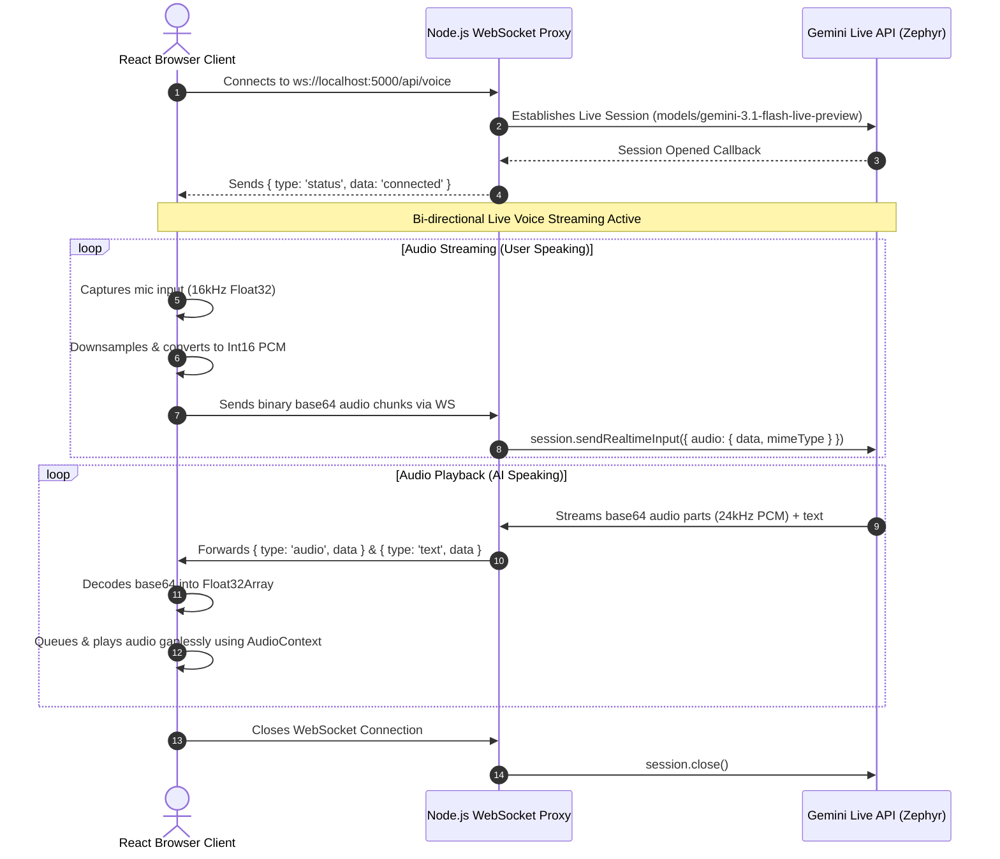

# 🎙️ Saarthi AI (Voice Sandbox) — Present Version Documentation

Welcome to the documentation for the current **Sandbox Version of Saarthi AI**. This version establishes a fully functional, real-time, bi-directional audio streaming voice assistant utilizing the new `@google/genai` Live API over WebSockets.

Currently, this module acts as a **general talk sandbox**—providing a simple, highly responsive interface to verify low-latency audio capture, streaming, decoding, and playback before integrating scripture datasets or emotional counseling rules.

---

## 🗺️ Architectural Overview

The present version uses a **pass-through WebSocket proxy architecture** to securely connect the browser with the Gemini Live API without exposing your `GEMINI_API_KEY` to the client.



---

## 🛠️ Code Components & File References

The implementation is modular and clean, split across the following key files:

### 1. Main Landing Button
* **File:** [page.tsx](file:///c:/Users/hp/OneDrive/Desktop/MENTAL%20WELLNESS/frontend/src/app/page.tsx)
* **Description:** Integrates an elegant, high-contrast, minimalist button `"🎙️ Saarthi AI (Voice)"` directly beneath the Arjuna Mode headings using Tailwind tokens aligned to the 8px spacing grid.
* **Navigation:** Redirects users instantly to the `/saarthi` route.

### 2. Sandbox Voice Client
* **File:** [saarthi/page.tsx](file:///c:/Users/hp/OneDrive/Desktop/MENTAL%20WELLNESS/frontend/src/app/saarthi/page.tsx)
* **Key Features:**
  * **Mic Capture:** Requests user microphone access with noise suppression and echo cancellation. Utilizes the native browser `AudioContext` and a `ScriptProcessorNode` to downsample microphone inputs to `16000Hz` and encode them to 16-bit PCM little-endian.
  * **Gapless Playback:** Receives base64 PCM data. Parses the returned sample rate (typically `24000Hz` from Gemini Live) and converts it to Float32. Employs a custom lookahead queue-scheduler (`nextPlayTime`) in the `AudioContext` to chain audio buffers without overlap or "popping" noises.
  * **Status & Transcript Console:** Tracks connection states ("Disconnected", "Connecting...", "Connected and listening!") and outputs real-time speech-to-text transcriptions inside an accessible, reader-friendly glassmorphic panel.

### 3. Backend WebSocket Proxy
* **File:** [voiceSocket.js](file:///c:/Users/hp/OneDrive/Desktop/MENTAL%20WELLNESS/backend/services/voiceSocket.js)
* **Key Features:**
  * **Gemini Live Client:** Uses the new `@google/genai` library to establish a persistent session with `'models/gemini-3.1-flash-live-preview'`.
  * **General Voice Agent Prompt:** Sets up system instructions directing the model to act as **Saarthi**—a friendly, conversational voice assistant providing natural, short, and empathetic responses suited for speech dialogue. It avoids mental wellness counselling or religious references for now, as requested.
  * **Voice Selector:** Sets the prebuilt voice configuration to `'Zephyr'` for a high-quality, soothing, premium speaking experience.

### 4. Unified Server Configuration
* **File:** [index.js](file:///c:/Users/hp/OneDrive/Desktop/MENTAL%20WELLNESS/backend/index.js)
* **Description:** Wraps the standard Express app inside an HTTP server using Node's native `http` module. It binds the `initVoiceSocket` handler to the same port (`5000`) on the path `/api/voice`, avoiding CORS or multi-port setup complexities.

---

## 🚀 How to Run & Test the Sandbox

Follow these steps to spin up the services and test the voice sandbox on your local machine.

### Step 1: Verify Environment Variables
Ensure your [backend/.env](file:///c:/Users/hp/OneDrive/Desktop/MENTAL%20WELLNESS/backend/.env) contains a valid Google Gemini API Key:
```env
GEMINI_API_KEY=AIzaSy...
```

### Step 2: Start the Backend Server
Open a terminal in the `backend/` directory and run:
```powershell
# Installs dependencies if not already done
npm install

# Starts server in hot-reload development mode
npm run dev
```
*You should see:* `Server is running on port 5000` and `Voice WebSocket server initialized on path /api/voice`

### Step 3: Start the Frontend Application
Open another terminal in the `frontend/` directory and run:
```powershell
# Starts the Next.js development server
npm run dev
```
*You should see:* `Ready in ...ms` (usually running on `http://localhost:3000`)

### Step 4: Run the Voice Session
1. Open your browser and navigate to `http://localhost:3000`.
2. Click the **🎙️ Saarthi AI (Voice)** button.
3. In the sandbox screen, click **Tap to Speak**.
4. Grant microphone access when prompted.
5. Once the status shows `"Connected and listening!"`, say hello! 
6. You will see the AI's transcription scroll by in real-time, and you will hear **Saarthi (Zephyr)** speak back to you with extremely low latency.
7. Click **Tap to Stop** to close the WebSocket session and release your microphone.

---

## 🔮 Next Phase Roadmap
Once you are fully satisfied with this sandbox voice integration, we will proceed to:
1. **Empathy Mapping:** Integrate the emotional analysis triggers from [geminiService.js](file:///c:/Users/hp/OneDrive/Desktop/MENTAL%20WELLNESS/backend/services/geminiService.js).
2. **Scripture Integration:** Connect the Bhagavad Gita database seeded in MongoDB from [Verse.js](file:///c:/Users/hp/OneDrive/Desktop/MENTAL%20WELLNESS/backend/models/Verse.js) to trigger specific, gorgeous voice-guided reflections.
3. **Premium Visuals:** Refactor the UI into the premium dark-mode digital sanctuary with the audio-reactive breathing lotus orb.
